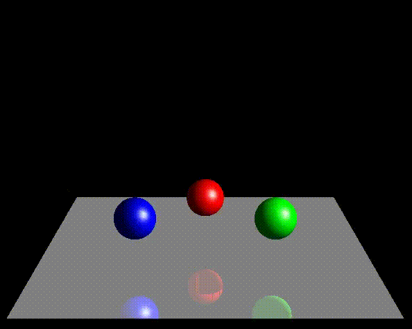

# Bouncing-balls-3D-animation
Creation of a 3D scene with three spheres, each of color, with a reflected (glossy) surface.  The spheres that traverse the surface are not visible (transparent). 

We used C++ language, CodeBlocks IDE and OpenGL with FreeGLUT.

 The 3D Animation GIF 

